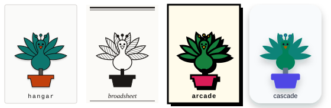

# Topiary



**Tokens drive form. Components drive function.**

Like its namesake — one living structure clipped into unrelated shapes — the
same peacock above is drawn exactly once; only the tokens change. Formerly
published as `@jasonrundell/dropship`.

Topiary is a React component library built around one claim: the same markup
should render as designs that look unrelated, with nothing changing but a token
file. It ships four, and they differ _structurally_ — corner radius, border
weight, how elevation is expressed, typeface, even where a card puts its media —
not only in colour.

The component set is small on purpose. The components exist to demonstrate the
token contract; the contract is the part worth taking.

## Where to look

- **[Storybook](https://topiary-storybook.vercel.app/)** — every component in
  every design, with a switcher in the toolbar, a live token reference, and a
  page tracing one rendered card back to the tokens that painted it.
- **`npm run dev`** — the landing page, which builds itself out of these same
  components and lets you swap the design underneath it.

## Requirements

- React 19 and React DOM 19 (peer dependencies)
- Node 22 or newer for local development

Topiary has no runtime dependencies of its own — styles compile to plain CSS at
build time, so there is no styling library to install alongside it.

## Installation

```sh
npm install @jasonrundell/topiary
```

Import the stylesheet once, at your application's entry point:

```js
import '@jasonrundell/topiary/style.css'
```

Then import components as needed:

```jsx
import { Button } from '@jasonrundell/topiary'

function App() {
  return <Button label="Click Me" />
}
```

## Atoms

Atoms are the basic building blocks of a user interface. Here are all of the
atoms included in Topiary:

| Component    | Key props                                                                                     |
| ------------ | --------------------------------------------------------------------------------------------- |
| `Blockquote` | `color`                                                                                       |
| `Box`        | `isTight`, `isRoomy`                                                                          |
| `Button`     | `label`, `primary`, `size` (`small`/`medium`/`large`), `onClick`                              |
| `Card`       | `media`, `title`, `children`, `actions`, `titleAs` — slots arranged by the theme              |
| `Container`  | —                                                                                             |
| `Grid`       | `columnGap`, `rowGap`, `gridTemplateColumns`, `mediumTemplateColumns`, `largeTemplateColumns` |
| `Heading`    | `level` (1–6), `id`                                                                           |
| `Link`       | `href`, `label`, `target`, `rel`, `onClick`                                                   |
| `Row`        | `justify`, `align`                                                                            |
| `Spacer`     | `smallScreen`, `mediumScreen`, `largeScreen` (`xsmall`–`xlarge`)                              |

## Themes

Topiary ships four themes that render **identical markup** in deliberately
unrelated ways — a CSS Zen Garden for component libraries. Tokens drive form;
components drive function.

| Theme        | Character                                                                |
| ------------ | ------------------------------------------------------------------------ |
| `hangar`     | Default. Instrumentation: monospaced headings, sharp corners, hairlines  |
| `broadsheet` | Editorial print: serif, ink on paper, rules instead of boxes, no shadows |
| `arcade`     | Neo-brutalist: heavy outlines, hard offset shadows, saturated colour     |
| `cascade`    | Soft: generous rounding, blurred elevation, almost no visible borders    |

Switch themes with a single attribute — no rebuild, no JavaScript, and it
cascades, so you can scope a theme to any subtree:

```html
<body data-theme="arcade">
  <aside data-theme="broadsheet">…this subtree only…</aside>
</body>
```

The four themes differ on _structural_ axes, not just colour — `radius`,
`borderWidth`, `shadow`, `font`, and `letterSpacing`. That is what makes them
look unrelated rather than recoloured, and a test asserts they stay that way.

## Design tokens

Tokens live in `src/tokens/<theme>.tokens.json`, each a
[DTCG Format Module 2025.10](https://tr.designtokens.org/format/) document, and
compile to CSS custom properties.

Those custom property names are public API. Override one in your own stylesheet
to restyle every component that uses it — no rebuild required:

```css
:root {
  --topiary-color-primary: #0f766e;
  --topiary-radius-md: 0;
}
```

Names follow the contract's structure: `--topiary-color-*`, `--topiary-space-*`,
`--topiary-radius-*`, `--topiary-borderWidth-*`, `--topiary-shadow-*`,
`--topiary-font-*`, `--topiary-fontSize-*`, `--topiary-fontWeight-*`,
`--topiary-lineHeight-*`, `--topiary-letterSpacing-*`, `--topiary-duration-*`,
`--topiary-easing-*`, and `--topiary-breakpoint-*`.

Writing a theme means supplying that same set of tokens with your own values.
The contract is defined in `src/lib/schema.ts`, and a test verifies every theme
satisfies it exactly.

## Storybook

Storybook is the development surface: its job is to prove every component
answers to every design, which is why each story renders inside the theme
switcher and why axe runs over all of them in CI. The landing page is the
showcase.

Each component lives in `src/components/<Name>/` alongside its styles
(`<Name>.css.ts`), tests, and story.

## Scripts

| Script                    | Purpose                                                |
| ------------------------- | ------------------------------------------------------ |
| `npm start`               | Start Storybook                                        |
| `npm run dev`             | Serve the landing page on :5173                        |
| `npm run build`           | Build the library (ESM, CJS, types, CSS)               |
| `npm run build:demo`      | Build the landing page into `demo-dist/`               |
| `npm run preview:demo`    | Serve the built landing page                           |
| `npm test`                | Run the test suite                                     |
| `npm run test:watch`      | Run tests in watch mode                                |
| `npm run test:coverage`   | Run tests with coverage thresholds enforced            |
| `npm run lint`            | Lint (zero warnings tolerated)                         |
| `npm run typecheck`       | Typecheck without emitting                             |
| `npm run check:package`   | Build, then validate the package with publint and attw |
| `npm run build-storybook` | Build the static Storybook                             |
| `npm run prettier`        | Format the repository                                  |
| `npm run prettier:check`  | Check formatting without writing (runs in CI)          |

## Deploys

Two Vercel projects build from this repository, both from `main`:

| Site         | Build command             | Output directory   |
| ------------ | ------------------------- | ------------------ |
| Storybook    | `npm run build-storybook` | `storybook-static` |
| Landing page | `npm run build:demo`      | `demo-dist`        |

Both are configured in Vercel's dashboard rather than in a `vercel.json`, and
deliberately so. A `vercel.json` at the repository root is read by **every**
project whose root directory is the repository root, and its `buildCommand` and
`outputDirectory` override the dashboard. With two sites building from one root
there is no single file that can serve both — adding one would silently retarget
the other site's build. Keep the settings in the dashboard unless the projects
are given separate root directories.

## Contributing

Please open an issue first, then a pull request from a fork. See
[CONTRIBUTING.md](./CONTRIBUTING.md) for setup, the file layout each component
follows, testing expectations, and how releases work, or
[docs/HOW-TO.md](./docs/HOW-TO.md) for a walkthrough of building a component and
extending the token contract, start to finish.

## License

This project is licensed under the MIT License. See the [LICENSE](./LICENSE)
file for details.

## Related

Looking for unstyled semantic markup rather than styled components?
[`@jasonrundell/topiary-primitives`](https://github.com/jasonrundell/topiary-components)
is the companion library: polymorphic HTML primitives that ship no CSS.

## Links

- [NPM @jasonrundell/topiary](https://www.npmjs.com/package/@jasonrundell/topiary)
